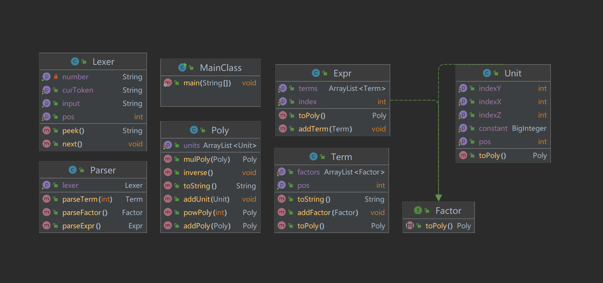

# OO第一单元：表达式展开  #
## 一.前言 ##
**写在最前面**:由于OO开课伊始入门较浅而作业强度较高，第一次作业经过一整个下午的构思后，笔者大致能将递归下降法的部分处理清楚，然而对于解析后表达式的计算，实在令人摸不着头脑。因此多项式模块等部分思路借鉴了Hy哥和YJK哥博客中提到的架构，在此表达感谢。然而整体架构笔者仍在其基础上进行了优化处理，使其更直观易懂，在下文我将细致分析。

第一单元的主题是表达式解析与计算，主要学习目标是让我们这些OO小白初步了解体会面向对象的思想，并浅浅进行代码上的实践（给大伙一点小小的OO震撼），把握不同类的拆分与继承，同时把握每一个类的属性，方法的设计，使得各个类间关系得当，构造出以类为基础的模块结构，并在主函数中用较短的代码（因为主要的代码实现应在类中）合理调度各个对象，实现最终要求。本单元共三次作业。。
## 二.第一次作业分析 ##
### 1.问题分析
第一次作业是关于带有多变量(x,y,z)的表达式展开，表达式的生成遵循一定的文法，省略掉空白符，大致如下：
>表达式 →→[加减] 项 | 表达式 加减 项
项 →→ [加减] 因子 | 项 '*' 因子
因子 →→ 变量因子 | 常数因子 | 表达式因子
变量因子 →→ ('x' | 'y' | 'z') [指数]
常数因子 →→ [加减] 允许前导零的整数
表达式因子 →→ '(' 表达式 ')' [指数]
指数 →→ '**' ['+'] 允许前导零的整数 (注：指数一定不是负数)

进一步分析，一个表达式大致能拆成如下的架构：
**表达式-->项-->因子-->常变量 / 表达式 --> 项...** 
它是一个递归的过程，可以使用递归下降法层层解析，直到将表达式拆成数个最小单元，也就是常量与变量。接下来我们会遇到一个最大的难题，我们该如何存储这些因子呢，第一种方法可以选择将数字和变量各开一个类，实现共同的接口令其成为因子。第二种方法，也是笔者最后采用的方法，将常量和变量全都看成一个**基元**，也可以称作**单项式**，即**pos(正负) constant(常数) * x ** index_x(x的指数，后同) * y ** index_y * z ** index_z**，由五个属性构成(pos,constant,index_x,index_y,index_z)。它像是一个广义的最小单位，这么做的好处是，不仅常量因子(变量的指数为0)和变量因子(常数项为1)可以统一由基元表示以外，连常量，变量，多项式彼此数学运算后得到的多项式也可以由多个基元构成，而且此种表示非常利于进行同类项的合并，因此我们可以想象到，无论是表达式，还是项，还是因子，都是由有限个**基元**构成，这为我们表达式的计算奠定了基础。
同时我们可以发现，题目中满足条件的表达式带有空白符，同时最多可能有三个正负号相连，极其反人类，这不利于我们解析表达式，因此在解析之前，应对表达式作以下处理：
(1)去除所有空白符(\n\t)
(2)找到相连的正负号，并将其转化为一个正负号

笔者的整体思路为，先对表达式进行简单处理，后使用递归下降法解析表达式，将表达式拆分成数个**基元**，再自底向上依靠运算规则合并整理各个基元，在最上层得到最后的多项式结果。

### 2.类分析
#### 首先UML类图如下：

#### (1)Lexer 词法分析器:
Lexer主要是将表达式分解成一系列的语法单元。本题目中语法解析器的实现并不难，我们大致可以得出基本的语法单元'x'，'y'，'z'，'数字'，'+'，'-'，'*'，'('，')'，值得注意的是读出数字时需要手动将前导0去除，peek方法用来获得当前读到的字符串(curToken)，next方法用来读过当前字符串并将指针(pos)指向下一个语法单元(Token)，二者通常配合使用，具体实现可参考Training中给出的样例。
#### (2)Parser 语法解析器:
Parser主要是根据表达式的形式化定义，依靠Lexer分析出的Token，将表达式解析分成三部分parseExpr(返回Expr)，parseTerm(返回Term)，parseFactor(返回Factor)，递归的生成表达式(Expr)，项(Term)和因子(Factor)，其中每一部分解析都遵循对应的文法，根据文法判断接下来该解析哪一类，例如解析表达式时遇到'+','-'则下一步应解析项，解析项时遇到'*'则下一步应解析因子，而解析因子时遇到'('，应继续解析表达式，遇到常量变量则应返回一个**基元**(Unit)类的因子。
值得注意的是对于符号的处理，表达式是不存在符号的，而在解析表达式时遇到的'+','-'便是项的正负，因此项是有正负的，其次要重点关注第一项可能无'+'，但也是正的。Unit类因子同样是有正负的，而指数即使不存在负号，但也有前置'+'的出现，在解析时要格外注意符号(**笔者认为最大难点**)。

#### (3)Expr 表达式类，Term 项类:
这两个类很相似，可参考Training，放到一起来说，Expr类中最主要的属性便是存储了Term类的ArrayList，还应存储表达式作为因子时的Index，若非因子则默认为1；Term类中最主要的属性是存储了Factor类的ArrayList，还应存储项的正负，若项为负则该项对应的多项式中所有Unit成员的正负将颠倒。
#### (4)Factor 因子接口:
Unit因子和Expr因子共同实现该接口，使其都能转化为Factor，便于统一存储。
#### (5)Unit 基元类：
在整体思路中对该类进行了较多的阐述，其用五个属性便可描述出一个Unit(注意构造函数初始化问题)，其余将放到后文多项式类中说明。
#### (6)Poly 多项式类:
该类虽独立于解析表达式过程，但却是本题重点中的重点，其属性是存储了Unit类的ArrayList，我们可以通过遍历ArrayList元素来得到最后的多项式(可改写toString方法，按照题目要求输出，在此不过多解释)，而Expr，Term，Unit类中都有各自的toPoly方法，其意思是将其转化为多项式表述。

Unit转化为Poly类很容易，new一个Poly并将Unit加入其ArrayList内即可；

Term转化为Poly需要考虑Term是由多个Factor通过'*'相连，因此我们可以实现mulPoly方法，即两个Poly相乘返回一个新的Poly，具体实现可通过对两个Poly的ArrayList进行遍历，只需通过对于Unit属性的运算便可完成一次相乘，再根据结果Poly属性的特征实时进行同类项合并即可，依次将toPoly后的Factor通过mulPoly方法，最后根据**Term的正负**调整Poly内各项Unit的符号；

Expr转化为Poly同理，考虑到Expr是由多个Term通过'+'相连，可实现addPoly方法，即两个Poly相加得到新的Poly，最后根据Expr内Index进行指数级运算，可实现powPoly方法，具体实现为调用index(因人而异)次mulPoly即可，具体实现方法类似。

要注意我们在addPoly，mulPoly的同时便同时完成了对于单项式的合并化简，因此并没有单独的化简操作。

我们在解析表达式后，得到了一个Expr对象，也隐含着得到一颗递归树，其根节点都是Unit类对象。我们在最上层令Expr执行toPoly方法，其便会沿着解析结构层层下降并递归，最后返回目标Expr的Poly，再按照题目要求输出优化即可。

### 3.坑点及优化细节
(1)存常数时要使用BigInteger，因为题目中并无常数范围

(2)x**2 可优化为 x*x

(3)无变量项的可忽略变量，有变量项且常数项为1的可忽略1(后面还有个*)，同时注意表达式最后只含一个基元且常数项为0时的输出

(4)将正项挪到第一个输出并忽略正号