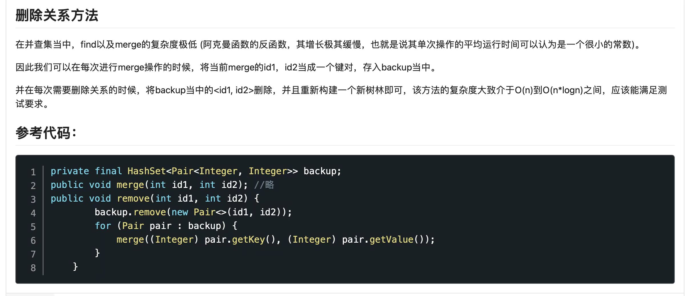

# OO第十次作业

## 指令含义
|指令|输入|简写|含义|
|--|--|--|--|
|add_person|id(int) name(String) age(int)|ap|添加人物|
|add_relation|id(int) id(int) value(int)|ar|添加二人关系|
|modify_relation|id(int) id(int) value(int)|mr|修改二人关系|
|add_group|id(int)|ag|新建小组|
|add_to_group|id(int) id(int)|atg|将某人加进某组|
|del_from_group|id(int) id(int)|dfg|将某人踢出某组|
|add_message|id(int) socialValue(int) type(int) person_id1(int) person_id2(int)\|group_id(int)|am|添加信息|
|send_message|id(int)|sm|发送信息|
|query_value|id(int) id(int)|qv|查二人关系值|
|query_circle|id(int) id(int)|qci|查二人是否社交图连通|
|query_group_value_sum|id(int)|qgvs|查组内关系值之和|
|query_group_age_var|id(int)|qgav|查组内年龄方差|
|query_best_acquaintance|id(int)|qba|查某人最好朋友|
|query_social_value|id(int)|qsv|查某人社交值|
|query_received_messages|id(int)|查某人收到的前五条信息|
|query_block_sum||qbs|查连通子图数目|
|query_triple_sum||qts|查三人组数目|
|query_couple_sum||qcs|查最好搭档数目|
|modify_relation_ok_test||mrok|okTest|

本单元一大特色便是不明着告诉你要实现的需求，需要自己通过JML描述和指令的命名去推理得到，同时更教会了我规格和实现分离的思想，只能说过于依赖规格会变得不幸，因此下文将不会再谈规格的事情。

有个很好笑的点在于第九次作业本人采用了BFS，天真的认为指导书上既然说了不太用看重算法的实现那bfs一定ojbk，最后寄的很惨，赶忙连带着第十次作业换了并查集，结果经过一天的思考发现并查集对于删边操作较为无能为力(在下面浅浅论证一下)，也许仍然可以使用并查集，但是要自创一个完备的算法，本人在尝试无果后选择放弃，又彻底改成了BFS。

接着本人得到最重要的结论，算法超时与否的核心在于对某几个指令(qci，qbs，qts)要选择**动态维护**而不是**静态计算**，而不是一定要选择比**BFS**性能更好的**并查集**图算法。或者说，使用哪个算法判断连通性无所谓，**像我寄的那样每条qci都重新构建一个邻接矩阵，qts时三重循环遍历**才是罪魁祸首。

## 并查集思想

并查集作用正如其名，适用于元素的合并与查找，合并即将两个不相交的集合合并成一个集合，查询即查询两个元素是否属于同一集合。并查集的数据结构是**森林**，对于每个结点都有一个父节点，森林中一棵树根节点的父节点是他自己。由此可以**将所有结点打包成一块一块**，像是武林中一个一个门派，一个个门派就像是森林中一棵棵树，每个门派长老都有各自的弟子，弟子又有弟子......但是一个弟子只能拜入一个门派。对于查询的情况，若想查询两个人是否“连通”，只需判断他们的长老是不是一个人即可。对于合并的情况，若两个门派选择合并，只需令一个门派的长老拜入另一个门派长老的门下，即一棵树的根节点的父节点设置为另一个棵树的根节点，这样一个门派的长老便拖家带口全部成为了另一个门派的一棵子树。门派的例子也许不太恰当，归根到底，对于并查集来说，**树只是一个容器，父节点只是为了将各个结点串联起来，树内每个结点都是一家人，并没有等级高低之分**，尤其是进行查询性能优化而进行按秩合并或压缩路径操作后。

对于实际情况来说，每当增加一个新的人时，便将父节点设置为自己；每当增加两人关系时，判断**他们的祖先结点是否是同一结点**，若是同一结点，则无需任何改动，若不是，则由于这条关系的添加，使得原不相干的两棵树建立起了联系，需要执行上述的合并操作；每当判断两个人是否连通时，需要执行上述查询操作。从复杂度角度而言，假设不采用路径压缩，合并的操作为O(h)，查询的操作也为O(h)，h为树的高度，十分高效，且空间占用小，且与第九次作业要求不谋而合，很难不使用并查集来处理。

然而高效率的代价就是它极大的局限性。

首先我们易知，在并查集中有多少个结点的父节点是自己即有多少张连通子图。若要将一棵树一分为二则是要找到一个不是当前根节点的结点，令其父节点指向自己，这样便实现了拆分的效果。

**由于并查集并不是原图的一张子图，会出现本不该有的“虚边”，在删除“实边”后且需要将树一分为二时，并不能通过简单的操作查找到需要被拆分的结点**。

在第十次面对mr导致的删除二人关系时，并查集显然犯了难。为解决这个问题，我们可以使用重建并查集的方式，在构建并查集的同时将每一对结点都保留起来，在需要删除时删除对应对，并遍历剩下的对重新构建并查集，用重新构图浪费的时间换查询的永久高性能。

## BFS VS 并查集 动态维护 VS 静态计算

笔者仍然采用了BFS的方法进行图运算，这么做的好处是，每当需要删边时，相应的邻接矩阵清除即可，无需重新构建，实现起来方便。在同样使用动态维护后与并查集性能相差无几。

动态维护指在某些造成影响的指令到来时即对某些全局变量进行更新，而静态计算指当特定查询指令到来时才去遍历数据计算结果，倘若下次仍然是同样的查询指令(不会改变原有状态)，则还再需要重新计算一遍结果，即使结果没有变化，这无疑是低效的。进一步来说，动态维护的优势还体现在**他充分利用了每一条指令所蕴含的信息，对未来可能到来的指令展开了未雨绸缪的计算**，但性能可能也会受到指令出现频率的影响。

第十次作业中，有几处笔者采用了动态维护的方法。

(1)qbs: 静态计算n方复杂度，也许不会爆，然而动态维护很方便，只需在加人时，增关系前，减关系后判断连通性即可。

(2)qts：静态计算n三次方复杂度，罪魁祸首。动态维护只需在增删关系时遍历找到二人共同的朋友即可。

(3)qcs：静态计算n复杂度，而动态维护较方便，对于每人维护一个Pair<bestFriendId,bestValue>即可。

(4)qba：同上。

(5)qgav：静态计算n复杂度，可动态维护组内的年龄和和年龄平方和，查询时直接带入方差公式计算即可，注意应严格按照JML标准(不严格会出现由于向下取整问题导致的差一现象)。

对于有些复杂度并非很高且动态维护较为麻烦的指令(qgvs)选择放弃，复杂度在n方之内的应当都可以接受。

## HashMap.equal

    public boolean equals(Object o) {
        //判断地址是否相同，是返回true
        if (o == this)
            return true;
        //判断输入o是否为Map类型，不是返回false
        if (!(o instanceof Map))
            return false;
        //将被比较的对象 o 赋给中间量 m
        Map<?,?> m = (Map<?,?>) o;
        //比较 m 和 a 的size大小是否相等，不相等返回false
        if (m.size() != size())
            return false;
        
        try {
            //定义迭代器 i 迭代 a
            Iterator<Entry<K,V>> i = entrySet().iterator();
            //迭代每个迭代器 i 中的每个元素
            while (i.hasNext()) {
                //定义一个映射条目 e 为 迭代器 i 的下一个元素
                Entry<K,V> e = i.next();
                //定义键值和值
                K key = e.getKey();
                V value = e.getValue();
                //判断值是否为null，进行下个判断
                if (value == null) {
                    //判断 m 中键值是否为 e.getKey() 是否得到返回null 同时 m 中是否有键值为                 
                    e.getKey()的键值，不满足则返回false
                    if (!(m.get(key)==null && m.containsKey(key)))
                        return false;
                } else {
                    //如果value != null ，判断 value 值是否等于 m根据键值 key
                    获得的 value 值相等，如果不是返回false
                    if (!value.equals(m.get(key)))
                        return false;
                }
            }
        } catch (ClassCastException unused) {
            //出现类转换错误返回 false
            return false;
        } catch (NullPointerException unused) {
            //出现空指针错误返回 false
            return false;
        }
 
        return true;
    }

HashMap提供的equals方法可以帮助我们判断一些简单的hashmap是否相等，我们可以看到判断key是否相等时采用的是containsKey，这保证我们的Key必须是同一对象，而判断value是否相等采用的是equal，这意味着我们可以通过重写类中equal方法来自定义value相等的条件。例如本次作业中HashMap<Intger, HashMap<Integer, Integer>> beforeData，afterData就可以直接使用equal方法判等。

## Bug

使用半随机方式进行较大规模的数据生成，并针对关系图的构建与查询针对性的构建了强测评测机，采用二人对拍的方式进行测评，这期间遭遇了数不清的Bug，在这里首先感谢我的评测机，当然我认为我的另一位朋友更应该感谢我的评测机哈哈，也感谢我们的持之以恒。
