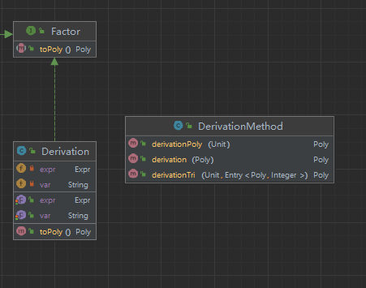
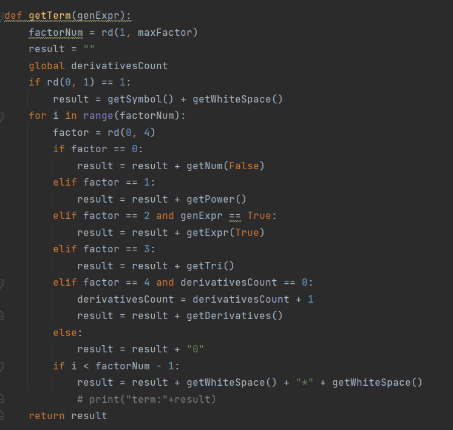

## 四.第三次作业分析 ##
### 1.问题分析 ###
本次作业相较上次新增了部分功能:支持求导操作，新增求导算子;函数表达式中支持调用其他"已定义"的函数。新增文法规则如下:
>因子 →→ 变量因子 | 常数因子 | 表达式因子｜求导因子
求导因子 →→ 求导算子 '(' 表达式 ')'
求导算子 →→ 'dx' ｜'dy' ｜'dz'

由于多变量的存在，这里的求导指求偏导，即对x求导则将另外两变量看作常数。
首先我们可轻松解决调用其他"已定义"函数的问题，在上次迭代中，我们将自定义函数的函数表达式部分与输入表达式一样使用递归下降法解析并输出，因此可自然的在解析时完成对于调用其他"已定义"函数的解析。

本次重点在于求导，抛开懂得都懂的求导规则，先来思考解析的问题。我们将求导因子也看成一种Factor(题目里说乐)，建立Deviration类，不难发现，当"d"出现时便可进行对于求导因子的解析。与其他因子类无异，内部需存储**求导算子**与**表达式**两个属性即可完整描述该类。在自底向上计算中遇到求导因子时，首先将Expr属性toPoly，接下来要完成的便是对于一个Poly的求导。

### 2.类分析
本次作业其余类改动不大，只展示新增部分。

#### (1)Deviration 求导因子类：
该类实现Factor接口，内部属性含有要求导的变量以及待求导的表达式，该类自然需要实现toPoly方法，即返回一个求导后的Poly对象。我们重点使用两个求导法则，乘法法则与链式法则:
>链式法则：[f(g(x))]′=f′(g(x))g′(x)
乘法法则：[f(x)g(x)]′=f′(x)g(x)+f(x)g′(x)

Poly实质上是由数个Unit相加得到，而每个Unit里则是单项式(eg.3*x\**2*y\**1*z\**3)与数个三角函数因子相乘得到，而三角函数因子内则会存在因子嵌套的情况。那么求导的思路便也清晰明了，对于数个Unit相加的求导，就是对各个Unit求导再相加即可，因此我们需要遍历Unit依次对Unit求导；而对Unit求导首先要用到乘法法则，这里我们可以将单项式部分统一求导，再依次对三角函数因子进行求导；而在对三角函数求导时要用到链式法则(长时间不做数学题可能要多花点时间复习复习)，对三角函数内部的Poly进行求导，本质同样是递归调用的过程。

#### (2)DevirationMethod 求导方法类:
该类是工具类，存放了求导变量，以及求导函数的实现，并将其拆分成三个子函数，分别是对总体Poly的求导，对单项式的求导，对三角函数的求导。

### 3.注意事项
(1)HashMap不能存重复键，求导时特别注意方法会不会改变原来的Poly的属性等。笔者建议**不确定时使用深克隆拷贝一份进行使用**，毕竟Java中**everything is reference**，请时刻思考拷贝对象时是该绑定在一起(引用)还是各自独立(new一个新的)。
(2)求导时调用addPoly和mulPoly，可令求导化简一条龙。

## 五.评测机搭建
本次作业的高效准确的完成离不开评测姬的鼎力支持，同时每个单元对于评测机的迭代开发也成了一个不简单的"作业"，甚至在第三次作业时搭评测机的时间超过了完成作业的时间。

简要来说，评测机是使用Python搭建，根据提供的文法为每一个结构(例如空格，符号，各种因子等)使用随机数随机生成的方法对其结构进行生成，并最后生成一个符合文法的字符串，将其传给python利用从事数学计算的**Sympy**包进行表达式运算同时传给我们所写的程序，python会通过代值验算的方法比较二者是否相等，进而完成评测。换句话说，我们的程序便是完成了一个玩具版的Sympy。

我们需要将所有代码打包成JAR格式的工件，在Python中配置好参数并传入，完成Python到Java的沟通，具体操作请参考笔者未来也许会上传的源码。

