# 面向对象程序与设计第一单元总结
## 一.前言
第一单元的主题是表达式解析与计算，主要学习目标是让我们这些OO小白初步了解体会面向对象层次化编程的思想，并浅浅进行代码上的实践（给大伙一..小小的OO震撼），把握不同类的拆分与继承，同时把握每一个类的属性，方法的设计，使得各个类间关系得当，构造出以类为基础的模块结构，并在主函数中用较短的代码（因为主要的代码实现应在类中）合理调度各个对象，实现最终要求。
本博客将分四个方面进行总结:度量分析，架构设计体验，自我Bug分析与找院友Bug方法，心得体会，接下来让我们一同走进美丽的OO世界。
## 二.度量分析
### 1.代码统计
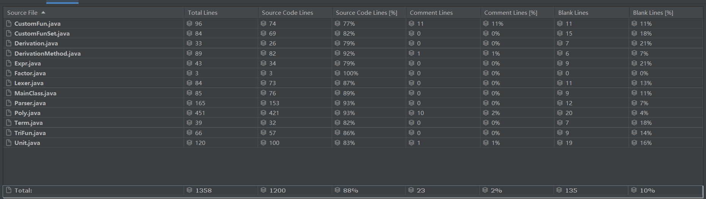
本单元最终统计代码量1300+行，包含部分注释与辅助函数，去除后整体代码量在1200行左右，与整个项目的难度预期相符。除Poly类外大多控制在100行内，较为符合**单一职责**原则；而Poly类内存在大量化简函数与计算函数，长度来到400+行。
### 2.UML类图分析
本单元历经三次迭代，最终UML类图如下，**白色**部分为第一次作业，**绿色**部分为第二次作业新增，**红色**部分为第三次作业新增。
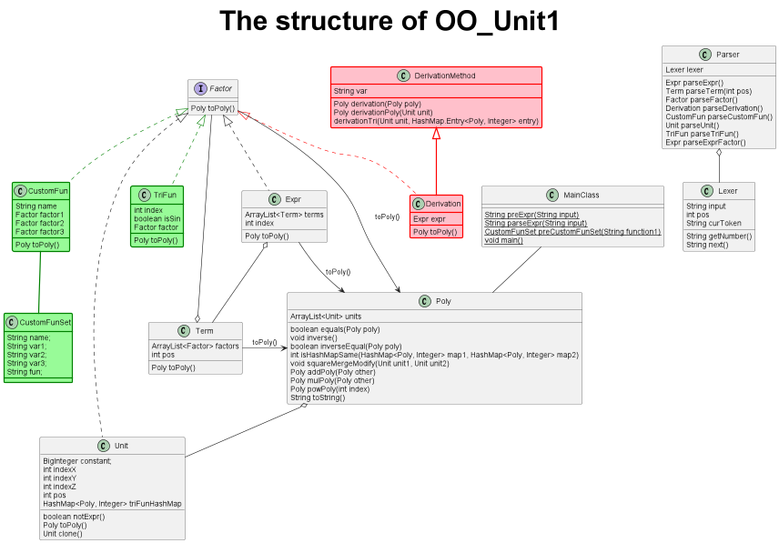
可以看到，本结构以Factor，Unit，Poly类的实现为核心，在后两次的迭代中仅是增加对应类以及其余类的方法，并未进行大规模代码改动，很好的符合了**开放封闭原则**，展现出了极强的可扩展性，尤其是第三次作业，笔者基于此良好的架构，两个小时便完成速通。
然而本架构仍存在不足之处，点名批评Poly类，可以看到其函数过多，其功能过于冗杂繁琐，笔者认为或许应当像第三次作业构造了求导方法类一样，考虑构建一化简计算工具类来存储这些函数，使整体结构更为独立与美观。
### 3.复杂度分析
#### 度量标准:
>OCavg:平均操作复杂度

>OCmax:最大操作复杂度

>WMC:加权方法复杂度

>CogC:认知复杂度

>ev(G):基本圈复杂度，描述非结构化程度

>iv(G):设计复杂度，描述模块耦合度

>v(G):圈复杂度，描述独立路径的数目

以上笔者也是头一次听说，并且对其的概念仅限于数越大越复杂越不太好。
#### 类复杂度:
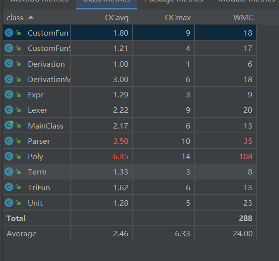
由图可见，Parser类的平均复杂度与加权复杂度较高，而Poly类极高。这是由于Parser类主要负责对于表达式的解析，本次作业中表达式，三角函数，自定义函数等因子皆支持嵌套构造，因此解析过程中不可避免的会反复递归调用解析函数，复杂度必然较高。而Poly类是由于实现第二单元引入的三角函数化简所致，笔者完成了基本化简外又化简了平方和，诱导公式，而这些化简步骤皆在该类内实现，因此复杂度极高，具体原因下文说明。
#### 方法复杂度:
##### (1)Poly类:
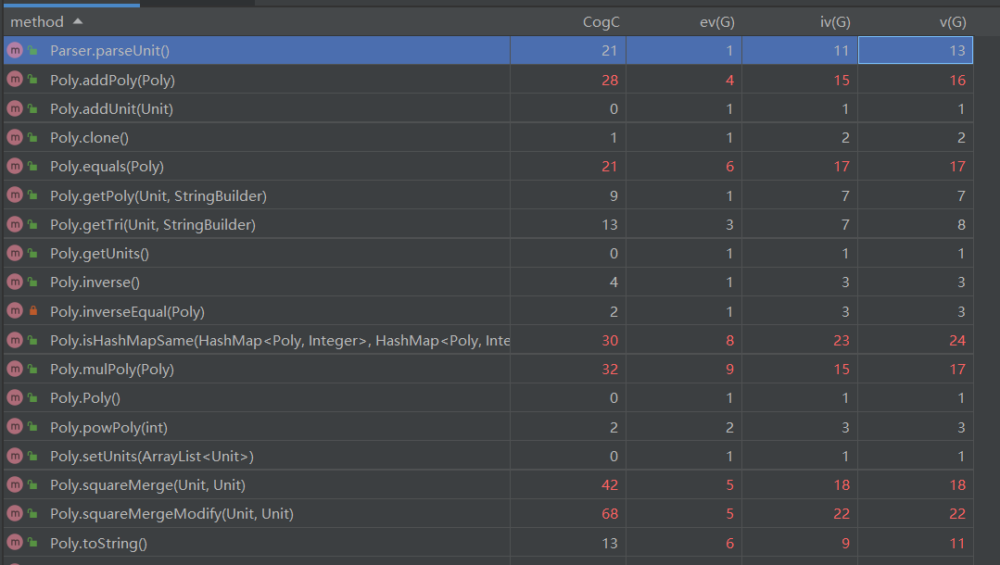
一片惨淡的红~该类复杂度极高便不奇怪了。
首先是重写的equals函数，其用于判断两个Poly是否相等，以及isHashMapSame函数，其用于判断两个HashMap\<Poly, Integer>是否相等，由于递归嵌套的存在，想简单实现是不可能了，笔者采用的是**深克隆**加"**消消乐**"的方法，以isHashMapSame函数为起始，即深拷贝出两份HashMap，接着**双循环**依次比较，每当键值对相同时便消去，直至全部消光即可判定相等，而键值对重点在比较“Poly”键，需要**深克隆**出两份ArrayList<Unit>，再去**双循环**依次比较，全部消光判相等，那么比较Unit重点又在于比较其HashMap，子子孙孙无穷尽也......可见如此反复递归调用，想不复杂都难，但最后一定会结束，因为HashMap到最后一定会为空。
接着是addPoly和mulPoly方法，用于多项式的加法与乘法，要反复调用上述两函数的同时自身也要进行**双循环**遍历，因此复杂度极高。
squareMerge方法用于两个Unit的平方和化简，在addPoly中调用,其本质即一边找到sin(x)方而另一边找到cos(x)方并判断其余部分是否相等(支持常数不相等)，相等即化简，因此同样需要**双循环**并调用isHashMapSame方法，复杂度同样极高。
##### (2)其余:
CustomFun，TriFun内的toPoly方法，Lexer内的next方法复杂度较高，原因在于存在大量if-else语句以及存在遍历与递归的过程。

可见存在双循环乃至更多，以及大量递归调用的函数复杂度偏高，也许可以找到更加合适的算法优化函数降低复杂度。

## 三.架构设计体验
第一次作业发布伊始，笔者甚是迷茫，架构从何搭起更是无从下手，经历一天的冥思苦想后决定进行一个借的鉴，而发现了单项式多项式的思路后，顿时茅塞顿开，并在其中加入了大量自己的想法。在几次迭代中始终保持此架构，且增加功能愈发熟练。

根据BNF文法，一个表达式大致能拆成如下的架构：
**表达式-->项-->因子(各种类型)-->递归...-->常变量** 
它是一个递归的过程，可以使用递归下降法层层解析，直到将表达式拆成数个最小单元，也就是常量与变量。
### 1.计算架构设计
在第一次作业中，我们可以将常量和变量全都看成一个**基元**，也可以称作**单项式**，即**pos(正负) constant(常数) * x ** index_x(x的指数，后同) * y ** index_y * z ** index_z**。它由五个属性构成(pos,constant,index_x,index_y,index_z)，是一个广义的最小单位，这么做的好处是，不仅常量因子(变量的指数为0)和变量因子(常数项为1)可以统一由基元表示以外，连常量，变量，多项式彼此数学运算后得到的多项式也可以由多个基元构成，而且此种表示非常利于进行同类项的合并，因此我们可以想象到，无论是表达式，还是项，还是因子，都是由有限个**基元**构成，这为我们表达式的计算奠定了基础。

而第二次作业新增了三角函数，以上概念明显不再可行，但就如何存储一个“基本单位”而言仍能发现有相通之处。笔者将每一个基元新增一个HashMap\<Poly, Integer>属性,其中HashMap中每一个键值对代表着一个三角函数因子， Poly存储的是该三角函数中含有的因子toPoly后的多项式Poly形式，Integer存储的是该三角函数因子的指数，同时令正数为sin，负数为cos，这点很有创造性，使用一个HashMap即可存储任何形式的三角函数，而通过这一键值对即可完全描述出一个三角函数因子。

Poly内存有ArrayList\<Unit>，事实上无论是Unit自身，还是其余每种因子和项,都可以看作是一个Poly,而在类中皆提供了toPoly方法以便将当前层次及以下的所有内容转化成Poly形式返回，在实现上只需对顶层表达式toPoly，便会依次递归调用各层的toPoly，并自下而上层层计算返回，得到最终结果
### 2.解析架构设计
本次笔者与大多数人无异，采用的是递归下降法解析，根据文法对表达式有规则的解读，并根据读取到的特定token进入到不同的解析函数中，由于后两次迭代主要是添加不同因子，因此仅在parseFactor方法内调用了新增的parseTriFun，parseDerivation，parseCustomFun即可完成解析。

### 3.各类的设计考虑
#### (1)MainClass
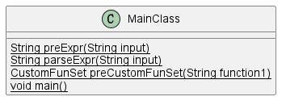

主类实现自定义函数与待求表达式的输入，对于所有表达式的预处理与构造解析器进行解析，将自定义函数拆解存入CustomFunSet类，以及最后输出结果。
#### (2)Lexer
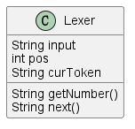

词法器类实现语法单元的顺序按步读取，耦合进Parser类中。
#### (3)Parser
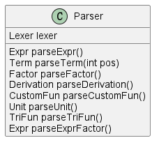

语法解析器类实现对于表达式的解析，生成一颗层次结构分明的表达式树。
#### (4)Expr
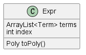

表达式类实现Factor接口，存储表达式以及表达式因子，由ArrayList\<Term>，本质是数个Term相加减，与指数(默认为1)组成，提供toPoly方法转化成Poly对象(下文不再重复)。
#### (5)Term
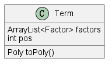

项类存储项单元，由ArrayList\<Factor>，本质是数个Factor相乘，和项的正负标识组成，笔者在此将项赋予了符号以便后续的计算与输出，然而在toPoly时应注意。
#### (6)Factor

接口类，本架构的精髓之处，所有种类的因子均实现此接口并重写toPoly方法，在存储时也均当作Factor对象统一存储，是**里氏替换原则**的最好体现。
#### (7)TriFun, CustomFun(第二次作业)，Derivation(第三次作业)
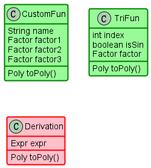

三角函数，自定义函数，求导函数因子，均实现了Factor接口，内部存储了描述对应因子的完备信息。
#### (8)CustomFunSet
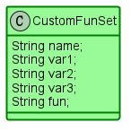

自定义函数定义类，存储了自定义函数定义的相关信息，包括函数名，变量名，表达式，属于工具人类。
#### (9)DerivationMethod
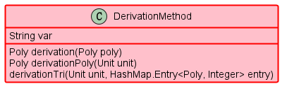

求导方法类，Derivation继承了该类，该类属于工具类，提供Poly对变量var的求偏导方法，现在再来想想将该类合并进Derivation类也有道理。
#### (10)Unit
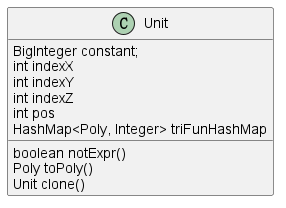

基元类，该类是核心类，有两个重要功能。由于在架构上笔者去除了独立的Num类和Var类，直接使用Unit类存储常量与变量，因此功能其一是作为因子实现Factor接口，而其二是作为**基本单元**存储基本项，所谓基本项即是由若干常量变量以及三角函数相乘得到。
#### (11)Poly
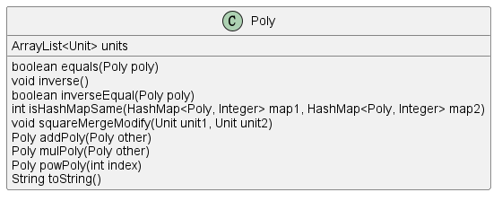

多项式类，由ArrayList\<Unit>组成，一切表达式相关类的终极形态，内置了大量的化简方法与计算方法。
## 四.自我Bug分析与找院友Bug方法
由于搭建了评测机进行了详尽的测试(Bug在测试里出麻了)，在三次强测与互测中，笔者均未出现Bug，而互测中笔者秉持人不犯我我不犯人的和平主义者思想，仅浅浅出刀五次刀中五次。

若问为何准确率那么高，因为哥们采用了评测机硬测的方法，说来惭愧并未细细品读房友的代码，但在一长段表达式中一点点截取出房友出Bug的地方过程中也明白了一些易错的点，与本单元自己犯下的错结合，一并与大家分享。

(1)存常数时要使用BigInteger，因为题目中并无常数范围

(2)注意自定义函数形参实参替换时左右加上"()"来保证运算顺序不变。

(3)若化简了sin(0),请注意sin(0)\**0 的问题，或者说注意三角函数指数是0的问题，有两刀都来源于这个Bug。

(4)**遇事不决深克隆** 深克隆很关键，避免破坏原有结构时应使用深克隆，对HashMap进行增删操作时应使用迭代器遍历。

(5)**不要过度优化** 过度优化将会给你带来意想不到的错误(来自一位朋友的惨烈教训)，圈复杂度越高出Bug的概率应当越高。

## 五.心得体会
在略带微凉的初春悄然降临时，第一单元也迎来了尾声。历经三次代码的迭代训练，两次研讨课，两次实验课，以及最后的一篇总结，笔者在这万里长征的第一步中窥探到了面向对象的魅力。老师以及指导书的讲解，两次实验课代码精巧的结构设计，加以自己动手coding的课程作业向我们展现了面向对象层次化程序设计的优雅，并企图教会我们这一深邃的思想。第二次研讨课上伙伴们细致讨论了OO的五大核心原则，即S(单一责任原则)O(开放封闭原则)L(里氏替换原则)I(接口分离原则)D(依赖倒置原则)原则，这对我启发很大，并一条一条的尝试往自己的代码中匹配，并加以反思写过的代码的不足与改进之处，这些在上文略有提及。

尽管笔者上学期上过OO先导课，尽管早就知道第一次作业是递归下降法解析表达式，尽管上学期第七次作业已经练习过递归下降法的实现，笔者在真正拿到第一单元的指导书并研究一个小时后，仍是不免发出一阵叹息，并转身投入到第一单元训练的怀抱中去，后对着训练任务照猫画虎完成了解析表达式后，又为计算发了愁(实际第一次作业的计算有了思路后较为简单)。思前想后，笔者认为本单元的难点在于化简计算，并非是递归下降法的实现，依然记得第二次作业设计架构时的纠结，既想保留现有架构，又要容纳的下三角函数因子，想过用ArrayList，想过开两个HashMap表示sin&cos，想过HashMap里存Factor，从当初到如今思路的定型期间经历了无数次思考与尝试。相信大家有同感，本单元最难点在于三角函数的化简，不考虑花活的化简，其实完成基础的化简后，实现出平方和，诱导公式等花活也并非难事。笔者在第二周一整周几乎都在研究化简工作(并不完全为了卷性能分)，边化简边生怕化出Bug，化简到神志不清，化简到后面一周都不想碰OO，功夫不负有心人，即使仍有一些化简不完全的Bug，但基本可以实现化简且并不影响正确性。当看到自己写的程序被大家挑不出毛病时，当和大家在侃侃而谈自己的设计实现思路时，当学到大开眼界的JAVA用法以及面向对象思想时，我想我收获到了来自OO这门课的快乐，也希望大家在每个单元的学习中不断提高境界，不断成长!

听说第二单元很多人边写边哭，边哭边写，已经迫不及待想被多线程电梯虐了捏(误。