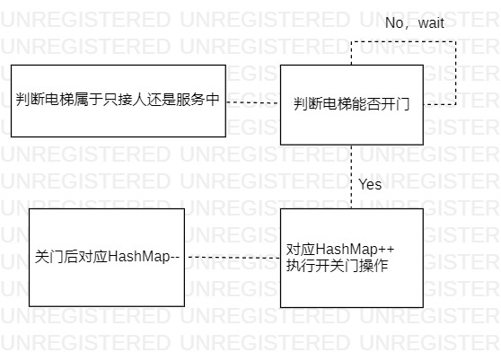
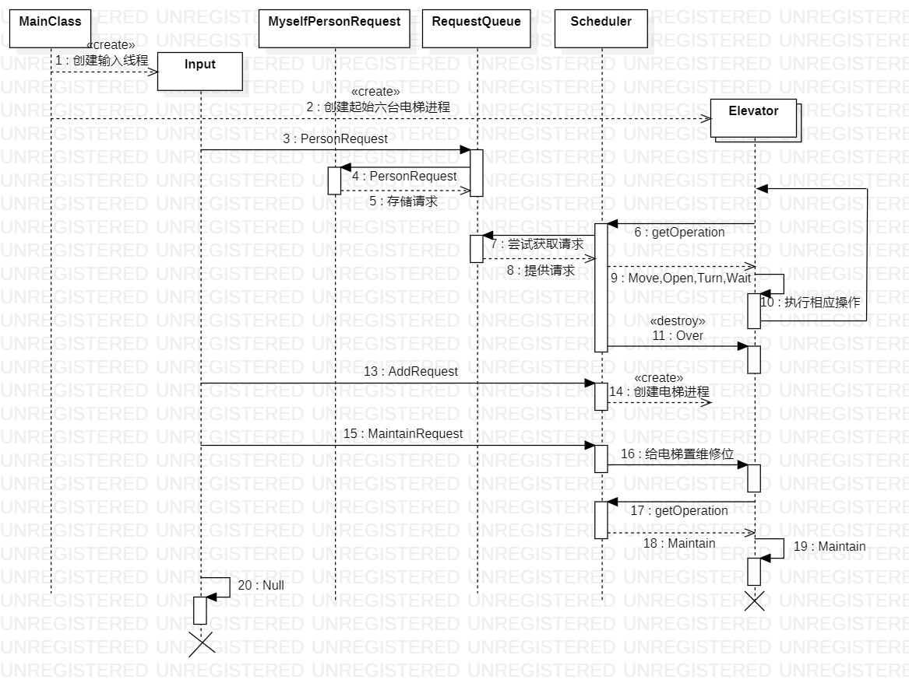

# OO第二单元实验总结

## 一.前言

三至四月实属是笔者大学生涯中最为辛劳的一段时间，一周一次的OO，操作系统的LAB2LAB3上机，蓝桥杯，以及最最最麻烦的冯如杯，与这段经历比起来，高三的最后冲刺也彷佛暗淡无光。一晃撑到了四月中旬，痛并痛着的电梯月即将迎来尾声，各种繁事琐事也纷纷有条不紊的结束，那便即以此篇收尾。

在本单元中，学习的主要目标是掌握简单的多线程程序设计方法以及更深一步体会层次化架构设计的魅力，为此我们进行了三个单元的多线程电梯迭代作业。第一次作业，要求实现一套简单的多线程电梯调度系统，大致可分解为单部电梯的运行策略和多台电梯的联合调度策略；第二次作业，为每台电梯新增了容量，起始楼层与运行速度的属性，以及扩展了增加电梯与维修电梯的请求；第三次作业，增加了每台电梯的可达性属性，以及对同一楼层的同时开门的服务中电梯，只接人电梯数量做出了约束。

笔者个人而言难度排序为1>3>2。

## 二.锁与同步块

本单元中笔者锁的选择就是synchronized关键字，并加之配合上sleep,wait,notifyAll的方法，完成了对多线程并发问题的处理。在研讨课讨论以及实验课上，还学习到了读写锁ReadWriteLock，以及信号量Semephore，同步容器ConcurrentArrayList等其他实现加锁的方式，笔者并没有更深入的了解，在此不过多介绍。

涉及多个线程间对于共享对象的访问时，则应该加锁处理，拿本次作业来说，对于输入线程和电梯线程而言，笔者架构的共享对象一共有三个，分别为**请求队列**，**全体电梯**，以及**楼层监视器(用来管控同一楼层同时开门的电梯数量)**，这三个共享对象皆放置在Scheduler(调度器)类中。

在本单元作业中，笔者只使用到了非静态方法锁和代码块锁，这二者本质都是锁一个对象实例，被锁包围起来的代码区域称作**同步块**，只能拥有对应锁的线程进入其中执行，其余线程需在外部等待，直至该线程释放锁(执行完代码块或wait)。线程wait后会进入等待池，需要其他获得对应锁的线程notify才能使wait线程被唤醒，进而参与锁的争夺以及执行后续的语句。为避免CPU轮询，我们需要合理使用wait-notify方法编程，一般来说需要wait的地方比较清晰，在本次作业中有：
* requestQueue(请求队列): 
  * 当前电梯内部无人且请求队列中无人时
* floorMonitor(楼层监视器): 
  * 当前电梯由于同步开门数量限制而无法开门时
* 由于采用了宏观调度的方式，笔者有一处地方采用了wait(时间)的方式，即当前电梯内部无人且请求队列有人，然而此刻请求队列中所有请求都不需要当前电梯接时。这是由于随着请求的不断更新各台电梯的状态难以控制，会出现一段时间过后当前电梯反而成了某个请求的最优解却在这段时间中没有触发notify的情况，此时wait便不是明智的选择。
  
而需要notify的地方则需要考究，若notify太少，则会出现线程无法正常结束，有些请求无法接到等问题，若notify太多，则会出现电梯线程等了又醒，醒了又等的类似轮询情况，很容易造成CTLE，在本次作业中有如下情况需notifyAll(综合了三次作业):

**很大一部分要思考的点在于如何结束进程上，笔者最后的思路是，任何一台电梯除维修外，只有当所有请求全部执行完后才有资格结束。**
* requestQueue: 
  * 当输入来临一个Person请求时，无需解释
  * 当有乘客从电梯内下车而下车点非目的地时，理由同上
  * 当输入彻底完成后，设置结束标志位时。因为会出现在Person请求早已全部执行完然而用增加电梯请求拖时间的情况，此时结束时所有电梯都在wait中
  * 当得到一个维修电梯请求时，因为此时对应电梯可能在wait中
  * 当一台电梯正常结束时。其他电梯全在等待，当前仅剩的运行中电梯线程执行完最后的操作后得到结束指示，接着它来唤醒其他电梯结束，归根到底即是需要一个"导火索"，与下一种情况一个道理
  * 当一台电梯的maintain执行结束时。考虑下述情况，其他电梯全在等待，当前维修的电梯还在运送最后一个人且能送达目的地，此时必须需要维修的这台电梯在结束时发出唤醒指令，令其他电梯可以正常结束

* floorMonitor:
  * 当一台服务中电梯关门时
  * 当一台只接人电梯关门时

同时在加锁过程中应注意有一些操作是**连贯**的，不允许被其他线程抢断，这种情况也需要对连贯操作打包加锁处理，具体参考下文分析Bug部分。

## 三.类分析与调度器详解

### (一).类分析
**第三次作业最终UML类图如下所示：** 蓝色部分为第三次作业新增类，第二次作业仅在原有类基础上修改，整体未经历重构。


整体使用生产者-消费者模式，随着结构便复杂，共享对象也在变多，Input线程作为生产者，而Elevator线程从一开始只是消费者，变成既是消费者又是生产者，但是总体思路不变。

#### 1. Input 输入类:

该类继承Runnable，与官方输入包对接，用来识别不同的请求并将其进行相应的分配，Person请求分配到RequestQueue，Maintain与Add请求分配到Scheduler，当输入结束时标记终止符。

#### 2. RequestQueue 请求队列类:

该类用来储存全部在请求队列内的人，为简化getset方法，采用了HashMap<Integer，ArrayList<MyselfRequest>>的结构实现，单独存储每层的请求队列。updataPath方法为第三次新增，用来对请求队列内全部请求重新规划路线。

#### 3. Operation 操作类:

该类作为枚举类，用来表示电梯可能要执行的全部操作。

#### 4. Elevator 电梯类:

该类继承Runnable，完成电梯执行与输出的各项操作。笔者认为一台电梯作为电梯不该拥有“思想”，即电梯只会乖乖听从调度器的话行事，因此电梯除自身属性外只拥有调度器一个外部对象，很好的满足了高内聚低耦合的原则。事实上笔者在整体架构的处理上一直秉持这一思想，即每个类既要满足单一职责原则，又要尽量和更少的类相关联。在方法上，该类在run方法中不断向调度器寻求建议，并根据调度器的建议机械执行相应的操作。与一般架构而言，有两点进行了优化:
1. 上电梯时采用**二次寻求策略**。根据笔者的调度策略，忽略下电梯的请求，只有在开门前判断好有请求上电梯，电梯才会选择开门，然而在开关门的0.4秒内，有可能会有其他可搭载的请求来临。因此笔者为电梯设置了一个缓冲区Buffer，并且采取开门-下人-sleep(400)-上人-关门的步骤，在判断是否开门时和真正上人之前皆将可行的请求置入缓冲区，在上人时从缓冲区里转移，并清空缓冲区。
2. 维修电梯时采用**最后一搏策略**。根据题意，电梯在收到维修指令时还能至多移动两层，考虑到效率问题，笔者没有选择就地放人，而是选择尽可能的继续运行。因此为每台电梯设置了一个等于2的常量lastStep，在电梯收到维修指令时每移动一层便减1，直至为0后放出所有乘客，当然若电梯内提前没有乘客则会提前结束。这其中涉及到一个小问题，那便是**指令来临和电梯接收存在时间差**，有可能在指令来临后与电梯接受前进行了一次move，因此最后改成在move中特判是否存在维修标记位，若存在则lastStep--。

#### 5. MyselfPersonRequest 人员请求类:

该类为第三次作业新增，由于Person请求在第三次中存在换乘的情况，仅仅使用官方的Person请求类得到fromFloor和toFloor显然不满足题目需求。因此笔者创建了该类，大致属性与原无异，区别在于使用ArrayList<Integer>存放此时从起点到终点的最短路径，并在内设置setSequence方法，核心思路是利用**未满电梯**的可达性序列构建邻接矩阵，使用BFS广搜获得最短路径。**该类对外部提供一层抽象，只向外提供数组的第0项，作为fromFloor，以及数组的第1项，作为toFloor，这会让调度器只关注于每个请求的第一段路线，像是在处理一个与第一第二次作业一样的从fromFloor到toFloor的请求，大大简化了调度器的设计(以及减少对笔者的脑子的折磨)，同时令电梯只接能送达至toFloor的请求**。
ps:由于使用未满电梯，请求会出现得不到可达路径的情况，此时令第0项为当前楼层，第1项为最终楼层即可，反正此刻也不会有任何一台电梯去接它。

#### 6. OverControl 结束控制器:

该类为第三次作业新增，实际从第一次就该如此设计。不必多说，大家一定都遇到过无法结束电梯进程的情况，随着设计变复杂，需要考虑的情况越来越多。因此该类统计输入线程输入的Person请求数量，以及Person请求到达最终楼层的完成请求数量，并在输入结束时置入标记位，**每台非维修电梯当且仅当输入数等于完成数且拥有结束标记位时才被允许结束**。

#### 7.FloorMonitor 楼层监控器类:

该类为第三次作业新增，用于满足同一楼层服务中与只接人电梯数量的限制。实现方法较为简单，作为全部电梯线程的共享对象，维护了两个HashMap<Integer,Integer>，表示某层当前服务中or只接人的电梯数目，在一台电梯执行Open操作时，执行如下流程:


#### 8. MainClass:
进行调度器，楼层监控器，请求队列等单例的初始化，开启初始的电梯线程与输入线程。

#### 9. Scheduler 调度器类:


该类是本单元核心类，用于实现对多台电梯的统一调度，主要通过getOperation方法来为电梯提供指令，并实现判断电梯该进行哪一步骤的算法，流程如下。

```flow
st=>start: Start 
op=>operation: getOperation 
cond0=>condition: 电梯是否需要维修
st->op->cond0
cond1=>condition: 电梯能否开门与是否需要开门
cond2=>condition: 电梯内是否有人
cond3=>condition: 请求队列是否为空
cond4=>condition: 是否满足终止条件
cond5=>condition: 电梯前方能否找到合适接的人
cond6=>condition: 电梯后方(包括当前层反方向)能否找到合适接的人
maintain=>operation: MAINTAIN
move=>operation: MOVE
move1=>operation: MOVE
open=>operation: OPEN
over=>operation: OVER
wait=>operation: WAIT
turn=>operation: TURN
waittime=>operation: WAIT(400)
cond0(yes)->maintain
cond0(no)->cond1
cond1(yes)->open
cond1(no)->cond2
cond2(yes)->move
cond2(no)->cond3
cond3(yes)->cond4
cond4(yes)->over
cond4(no)->wait
cond3(no)->cond5
cond5(yes)->move1
cond5(no)->cond6
cond6(no)->waittime
cond6(yes)->turn
```
经过琢磨后发现判断顺序应该不可变，这些判断将是调度的重点，放在后文论述。

### (二).调度策略

**调度器不单独作为一个线程，仅仅在电梯线程访问调度器时调度器才会进行调度，而非调度器作为线程去一直调度，后者考虑的情况太过复杂，且笔者也不太能理解**

首先考虑单台电梯的调度算法，LOOK算法显然是最稳妥的做法，那么六台电梯是否跟一台电梯有某种共同之处呢，笔者采用了一种针对单台电梯变种LOOK的宏观调控法。

这种方法正如其名，是动态的根据每台电梯的状态来为电梯提供指导，每台电梯没有一个明确的目标请求，且每台电梯的行为不仅取决于请求队列，还取决于其他电梯的状态，例如当一台空闲电梯在1楼，另一台在10楼，面临一个来自11楼的请求时，会让10楼的电梯去接，而1楼电梯保持不动。事实上这种方法一定不是完备的，当请求数变多变复杂时，难免会出现没有考虑到的情况，**但是一定要保证接到所有请求**。算法思路有很多很多，针对某个逻辑判断，某些情况下更好而某些情况会更烂，因此设计的思路将千奇百怪且没有最优解，笔者也仅是给出自己的思路抛砖引玉。这种方法的优点很显然可以省电，一定会令电梯尽可能少动，相对的运行时间和人员等待时间也许会更多，属于是资本阶级压榨人民了。

我们研究LOOK算法会发现，**一台空闲电梯在当前方向有人时会过去接，而当前方向无人且反方向有人时就掉头**。笔者作出了优化，更改为**一台空闲电梯在当前方向有更适合它接的人时会过去接，而当前方向无人且反方向有更适合它接的人时会掉头**，其余思想类似，如电梯内有请求就朝当前方向移动，开门时捎带所有同方向的请求等。因此主要针对空闲电梯的调度，即何时Move何时Turn进行改进。

什么称得上适合接的请求?当调度器为一台空闲电梯判断是否要去接人时，首先从远及近遍历当前方向上全部请求，针对每一个请求，调用thisMoreSatisfy方法，在该方法内，会判断其余所有非维修电梯与当前电梯谁去接更好(代码参见如下，逻辑些许复杂，不好解释清楚)，若发现至少一个令当前电梯去接更好的请求，则电梯选择Move，为更改第一个Bug，在后续又新增了若当前方向请求超过12个，则即使无更适合接的请求，也要Move，**这算是在电量与时间上寻求一个平衡**。

    public boolean timeCompare(Elevator it, Elevator other, MyselfPersonRequest person) {
        return it.getSpeed() * abs(person.fromFloor() - it.getCurrentFloor()) >
                other.getSpeed() * abs(person.fromFloor() - other.getCurrentFloor());
    }
    
    public boolean isUp(MyselfPersonRequest it) {
        return it.fromFloor() <= it.toFloor();
    }

    public boolean thisMoreSatisfy(MyselfPersonRequest it, Elevator elevator) {  //当前电梯为空 都认为彼此会接
            synchronized (elevators) {
                for (Elevator elevatorAll : elevators) {
                    //不是同一台电梯 且不在维修状态
                    if (!elevatorAll.equals(elevator) && elevatorAll.getMaintain() == 0 &&
                            elevatorAll.getAccess().contains(it.toFloor()) &&
                            elevatorAll.getAccess().contains(it.fromFloor())) {
                        if (elevatorAll.getCurrentNum() == 0 && ((elevatorAll.getDirection() == UP &&
                                elevatorAll.getCurrentFloor() <= it.fromFloor()) ||
                                (elevatorAll.getDirection() == DOWN &&
                                        elevatorAll.getCurrentFloor() >= it.fromFloor())) &&
                                timeCompare(elevator, elevatorAll, it)) {
                            return false;
                        }
                        if (elevatorAll.getCurrentNum() > 0 &&
                                elevatorAll.getCurrentNum() < elevator.getCurrentNum()) {
                            if (((elevatorAll.getDirection() == UP && elevatorAll.getCurrentFloor()
                                    <= it.fromFloor() && isUp(it)) ||
                                    (elevatorAll.getDirection() == DOWN && elevatorAll.getCurrentFloor()
                                            >= it.fromFloor() && !isUp(it))) &&
                                    timeCompare(elevator, elevatorAll, it)) {
                                return false;
                            }
                        }
                    }
                }
                return true;
            }
      }

调度器判断是否需要Turn同样需要用到如上方法，令电梯判断反方向上有无更适合接的请求，由于笔者的当前方向和反方向的定义是没有考虑当前层的，因此还需额外判断若该电梯转向后能否接到当前层的请求，若二者满足其一，则Turn，若否，则Wait(400)。

**第三次作业补充:需要为请求重新规划路线的时刻**
1. 当增加电梯请求来临时，为全部请求队列规划
2. 当维修电梯请求来临时，为全部请求队列规划
3. 当Person请求来临时，单独为其规划
4. 当Person请求从正常电梯or维修电梯下来，且未到达终止楼层时，单独为其规划
  
### (三).UML协作图

由于是第一次接触协作图，已经尽力在画了，省略了部分类的协同。



## 四.Bug分析

本单元三次强测均遗憾错一个点。
1. * 错因：有一个点数据很离谱，几十个人从高层往下下，由于初始设计的调度器是不关注每层请求数量多少的，因此会出现先只派一台电梯接人，等到接满后还有别人，另一台电梯再上去，这样会极大的耽误时间，导致RTLE(就差一秒啊!)。然而笔者认为现实中的电梯应该是像这么运行，这时间卡的多少有点不合实际了捏。
    * 改正方法: 令调度器同时关注请求人数，若超过某个阈值，则所有电梯一起Move，非常拙劣，但是极其有效。
2. * 错因：在结束输入后，从维修电梯下来的请求没电梯去接了，其他电梯错判了某些情况，导致提前结束。
    * 改正方法：新增了OverControl类，令电梯在完成所有请求后统一结束，有效避免了上述问题。
3. * 错因：只接人的电梯超过限制。笔者并不确定问题究竟出在哪里，有一定可能是最开始提到**连贯语句**的问题，试想一种情况，假定当前第一层onlyIn=1，servicing=2，第一台只接人电梯判断可以开门，令servicing++后CPU切换线程到第二台只接人的电梯，此时onlyIn=1，servicing=3，第二台电梯判断可以开门，servicing++，onlyIn++，并在开关门过程中控制权再次转给第一台，此时onlyIn=2，servicing=4，显然已不能再开门，然而第一台已经执行过判断语句，因此第一台也会选择开门，造成问题。
    * 改正方法：将servicing++和onlyIn++上锁打包，一个线程必须连贯的执行这两个操作。
  
由于多线程的随机性，Debug在本单元是一件痛苦的事情，笔者选择自己构建极端数据加白嫖评测机的方式寻找Bug，并主要使用打印大法寻找Bug出现的位置，同时遇到Bug时会先将自己的程序看作单线程进行逻辑分析，若没错的话再去考虑与其他线程协同时可能引起的冲突。本次作业似乎并未遇到无法复现的Bug。

## 五.心得体会

行文至此，写的有些冗长，最后对电梯月做一个总结。

笔者在这一个月以来接触到了大量的有关多线程编程的新知识，尤其在编写第一次作业时显得捉襟见肘，一边思索了两天调度策略一边处理多线程遇到的并发等问题，深刻体会到了线程安全的重要性。为保护线程安全，我的方法是涉及到共享对象则统一加锁处理，但是要注意不能在同步块中进行sleep的操作，以及在遍历共享对象集合应使用迭代器进行遍历，这样可以避免线程并发的问题。至于层次化设计方面，由于在理论课与实验课中学习到了生产者-消费者模型，并在一开始便下定决心要编写一个多电梯的调度策略，架构是很自然设计出来了，并且在之后的迭代中坚持SOLID原则，主体框架不变，在主干上增枝添叶，由于第三次作业中笔者认为原架构开的类有些少，因此又刻意多设计了几个类出来看着更美观，当然实际上这些类自然也有它们被设计出来的道理。

笔者认为本单元作业的设计很有创新性，也极具挑战性，这都是前几年OO所感受不到的小小电梯震撼。同时逐步给电梯系统加限制也很好的满足了训练迭代化设计能力的目标，笔者由于未经历重构，综合体感下来，在一次次增加要求中看着自己的架构越来越完善，逻辑越来越清晰(复杂)，还是颇有成就感与挑战感的。奈何后两次作业由于种种原因没有认真测试，撒手不管，很遗憾在电梯月里没有画上一个完美的句号。

年年岁岁花相似，岁岁年年人不同。看着往届学长的博客中对三四月奔忙的感慨，笔者也有所释怀，没想到跨越了一年我们仍能心境相通。希望略清闲的下半学期可以更加用心对待OO，用心对待身边的一切。