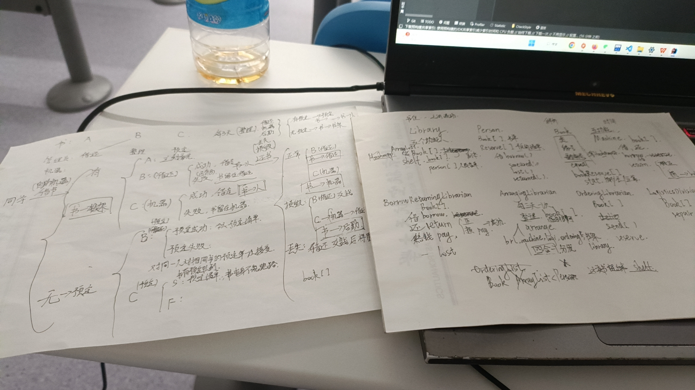
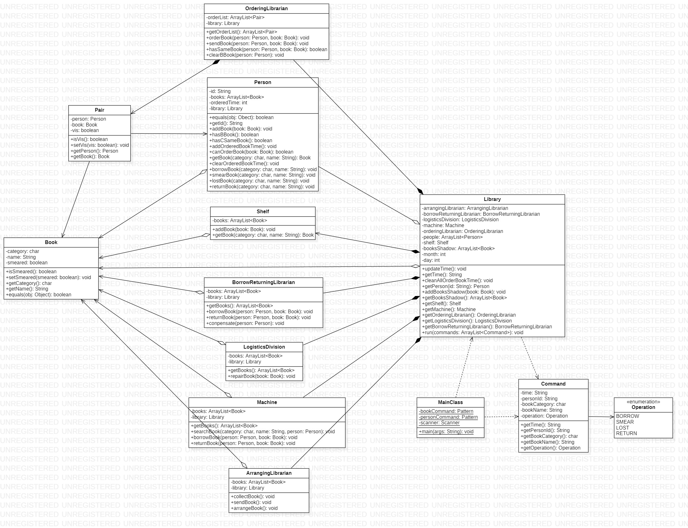
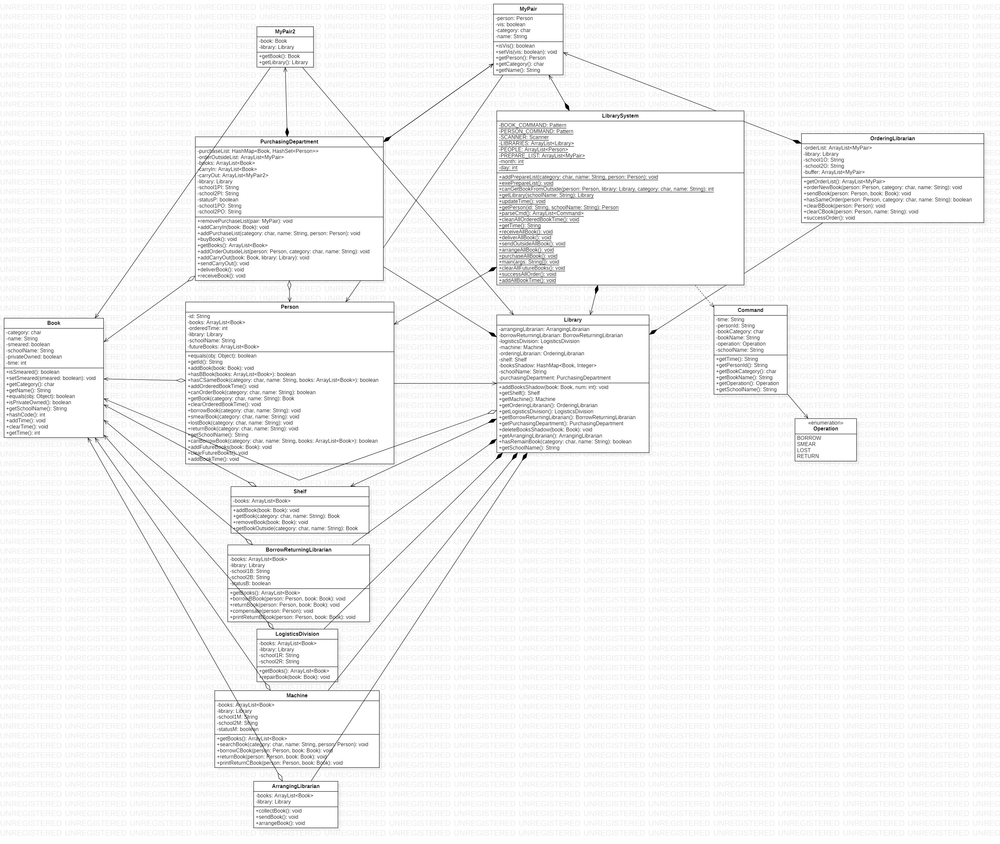
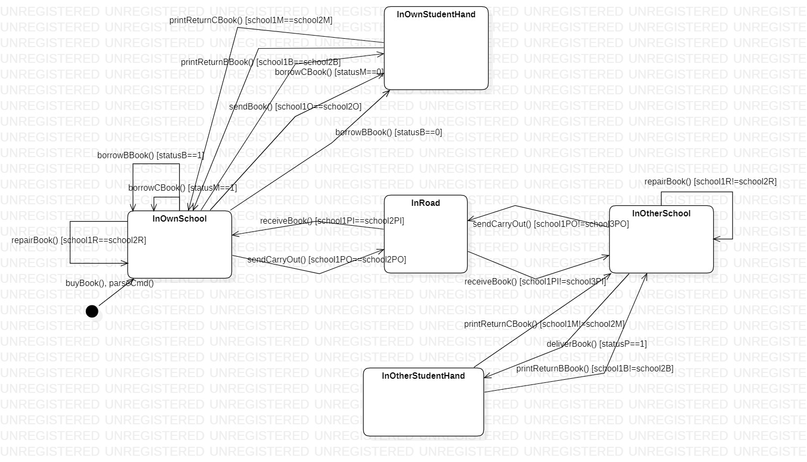

# OO第四单元暨总体总结

## 一.前言

随着马原考试铃声敲响，大二一学期的学习生活即将告一段落，由于考试周的复习以及准备os的挑战性任务答辩，期末周显得格外匆忙(也是自己有点泄劲了)。抱着还是要用心总结一下这学期以来对OO的感受的想法，于是选择在最后一天的下午完成最后一次的博客，为面向对象课程画上一个圆满的句号。

## 二.正向建模与开发

本单元重点考验我们对程序架构的设计和抽象能力，以及加强对UML图的绘制训练，在三次迭代开发中完成一个小型的图书管理系统，并逐步增加校际借阅与购书，还书逾期处理等功能，同时使用UML类图，状态图，顺序图辅助完成代码工作。

本单元鼓励我们采用正向建模的方式，即先画出类图，构造好类的功能和类与类之间联系，再去进行代码的实际实现，由架构指导实现的出发点是很好的，在较大规模的设计开发中必须要先有整体的架构设计，分成不同的模块，无论是分配给不同的人做也好，抑或是让实现者有明确的思路也好，无疑是有所裨益的。在本单元第一次作业中，我先在纸上画出了草图，再根据草图完成代码，最后补充了UML图(相信很多人都是如此)，我认为这也算是正向建模的体现。至于为何老师一直提倡的一定要先画UML图难以落实，我认为在设计伊始并没有办法设想出所有实现的细节，许多问题只有在实践中才会遇到，同时在实践中所创新出的更加优秀的想法可能需要大幅度调整自己的架构。无论如何，如果没有UML的机械评测，在面对复杂问题时，我想我是很愿意先设计架构画出UML类图的。

引用听到的一位同学的观点，本单元指导书对于需求不像一个真正的甲方那样是抽象的表述，而是方便我们完成作业或是方便评测正确性，而具有很强的引导性的表述。主要体现在差不多喂到嘴边的类的设计，约束住的输出逻辑，经常使用保证数据不会出现的字眼，同时描述出了分散且繁琐的借书过程(于是讨论区成了另一本指导书)，导致整体体验并不是很好，我认为课程对于模型化结构化的设计思维训练与引导有待进一步加强。

## 三.架构设计

本单元的架构设计没有经历太大重构，在第一次作业的引导下我将每个部门都当成一个类，后续的作业也继续保持，尽管类图画出来赏心悦目且符合实际，然而其中大量涉及到各个部门的联系，需要很多本不该存在的属性，造成类之间耦合度较高而类内内聚程度较低，不值得提倡。将图书馆的整体当作一个类是明智的选择。

第一次：

后两次大致无异：

状态图(若不是评测机制，想必应该会做的更好)：

## 四.架构设计思维的演进

四个单元的训练重点各有侧重，但始终蕴含着架构设计思维：

第一单元完成了表达式计算与化简，训练重点在于**层次化设计与递归下降法**，设计了 表达式 -> 项 -> 多种因子 的层次架构，并从单项式到多项式由底至上返回，使我深刻体会到了类之间互相蕴含与配合竟能发生如此奇妙的反应。

第二单元完成了多线程电梯的设计，训练重点在于**对设计模式的理解与并发式编程的处理**，通过生产者-消费者模式，观察者模式等设计模式的实现，体会到了其在架构设计上的重要性与必要性，同时在今后的coding中我也会保持思考能否采用适合的设计模式进行实现。

第三单元完成了社交网络的设计，训练重点在于**JML规格化设计与对"设计与实现分离"理念的理解**，由于本单元给好了很不错的架构，只需重点关注性能的优化，算法的实现。

第四单元模拟了图书馆的运作，训练重点在于**UML图模型与模型化设计**，通过更为直观的UML图可以更直观的分析架构，由于这次我的架构实在是太庞大臃肿了，因此更加领悟了架构设计**高内聚低耦合**的真谛，这条准则是我对一学期以来学习到的架构设计思维的极简概括。简洁，完美，应当是我们老一辈计算机人共同的追求。

## 五.测试思维的演进

测试是工程中重要的环节，也是想得分必须进行的重要环节，课程组在这方面煞费苦心，而我们也在课下付出了很多的心血以求强测互测不被橄榄。测试从数据构造角度说大致分为两种，使用评测机测试和手搓数据点测试，一般采用先手搓后评测机的测试方式。

我在第一与第三单元搭建了评测机，因为实现较为简单，第一单元使用python的numpy数学工具包，第三单元由于对数据限制性不大且答案唯一，直接随机生成数据对拍即可。第二单元需要用逻辑检验正确性，第一次作业以后用了良心院友的评测机，在此表示万分感谢orz。第四单元由于对输入数据的限制较大，在脑海里构想了一下便放弃了，好在由于手搓数据的强大，帮我顺利通过了强测。

在第三单元中涉及到了黑白盒测试，单元化，模块化测试的思想。其中功能测试，集成测试，回归测试的概念虽然是第一次听说，但实则早已应用到实际的测试过程中去。以第三单元举例，我在构建评测机时便针对所有的指令开展了集成测试与针对部分指令构成的某一功能开展了功能测试，并在修复完Bug后开展回归测试，这与我们的测试思想不谋而合。我的测试思维的演进主要体现在**压力测试**上，工程对于代码的性能势必会作出约束，我此前不曾拥有这种思维，导致三单元第一次作业性能上暴毙，这无疑给了我沉重一击，也让我更加理解了压力测试的重要性。

总的来说，测试应从点到线，由线到面，由单元到整体，同时测试的规模要大，数据量要大，这样才能保证我们代码的健壮性与正确性。

## 六.课程总结与收获

一学期的学习转瞬即逝，现在回想起自己竟完成了十二次代码训练感觉有些恍惚，面对第一次作业抓耳挠腮翻看学长博客的时刻还历历在目，没想到转眼间便迎来了尾声。重新翻出第一单元的递归下降和第二单元的多线程，当时懂到不能再懂的代码如今竟有些迷惑，我一直在问自己真的学到知识了么？我想，我们学习到的是一种面向对象思维，一种将各种事物依据一定的属性特征分类打包思考问题解决问题的思维，一种能厘清各事物间蕴含着的联系的思维，它并不依赖于某个特定问题而存在，它会如影随形指导我们面对接下来更加艰巨的挑战；自然，这门课程也高强度的训练了我的编码能力，测试能力，架构设计能力，优化迭代能力，语言表达能力，甚至是时间管理能力，听我说谢谢你，温暖了我一整个大二下学期。

没想到笔者还能拿到一个杰出性能奖，感谢这份奖品背后对我的肯定，感谢这一学期带给我帮助的伙伴们，感谢理论课的袁源老师以及所有认真负责的老师们与助教哥哥姐姐们，因为有你们，面向对象这门课程才会如此被代代六系学子津津乐道；也感谢这一路学习与 coding 中带给我的磕磕绊绊，~~使我更加相信经历风雨也未必看到彩虹~~。最后，即使遗憾未能成为OO助教团的一员，我仍祝愿面向对象课程可以在一届届的传承中取长补短去芜存菁，祝北航OO出于mit而远胜于mit！

